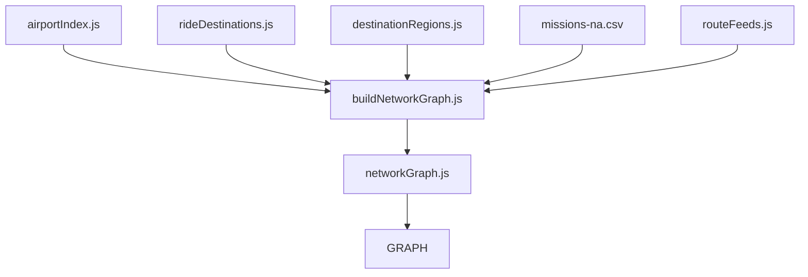
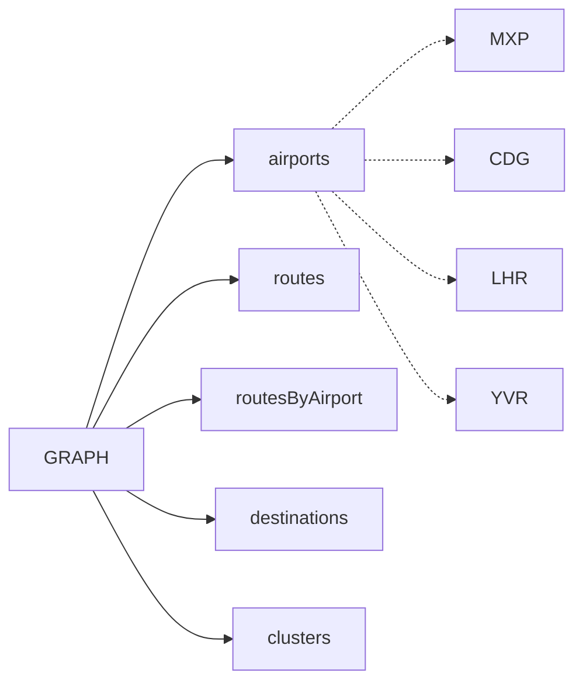
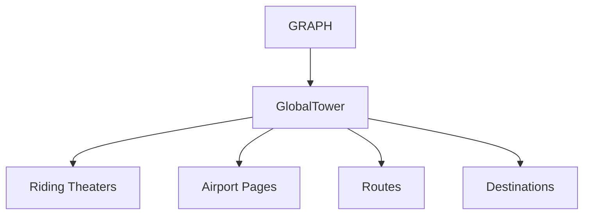
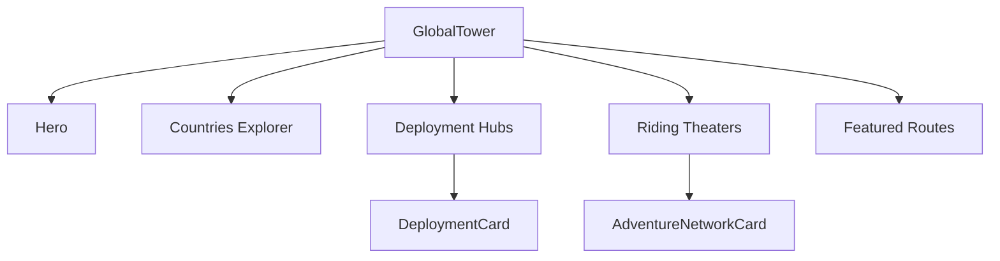
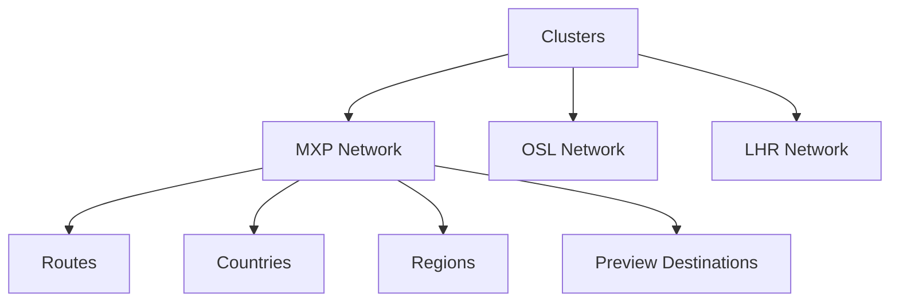
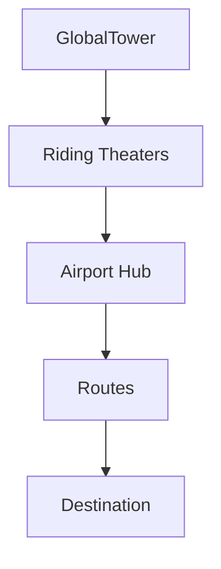
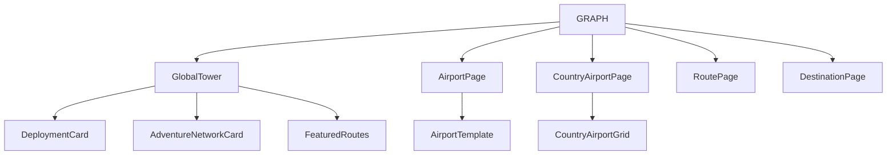
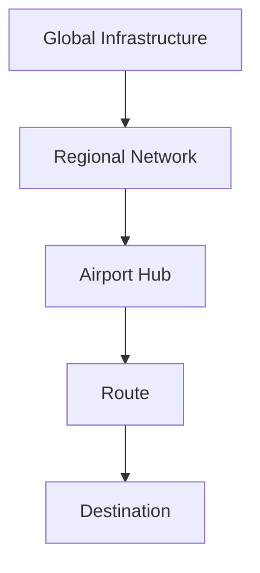

# JetMyMoto Platform Architecture Diagram

## 1. Core Data Engine

The JetMyMoto platform relies on a centralized data pipeline to gather disparate geographic and routing information into a cohesive, in-memory graph.



## 2. GRAPH Data Structure

The `GRAPH` object serves as the single source of truth for the frontend application, containing dictionaries and pre-computed indexes for O(1) lookups.



## 3. GlobalTower Rendering Pipeline

The GlobalTower acts as the top-level view, pulling data from the `GRAPH` and distributing it down to regional and granular component layers.



## 4. GlobalTower UI Sections

The GlobalTower component is composed of several distinct UI sections, each responsible for rendering specific aspects of the logistics network.



## 5. Riding Theater Layer

Riding Theaters (Clusters) group routes, destinations, and countries logically around a central airport hub, forming regional networks.



## 6. Airport Layer

Airport routing follows a canonical path, passing the requested code through the template which queries the `GRAPH` directly for connected routes.

```mermaid
flowchart TD
  U[/airport/:code] --> AP[AirportPage]
  AP --> AT[AirportTemplate]
  AT -. reads .-> RBA[GRAPH.routesByAirport]
```

## 7. Full Navigation Graph

The logical hierarchy of navigation from the broadest global view down to a specific destination.



## 8. Component Dependency Map

This map outlines how high-level page components and their child UI elements depend directly on the central `GRAPH`.



## 9. Platform Flow

The typical user exploration flow reflects the physical logistics of planning an expedition.


